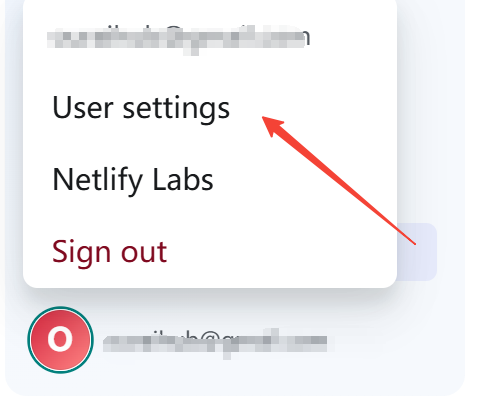
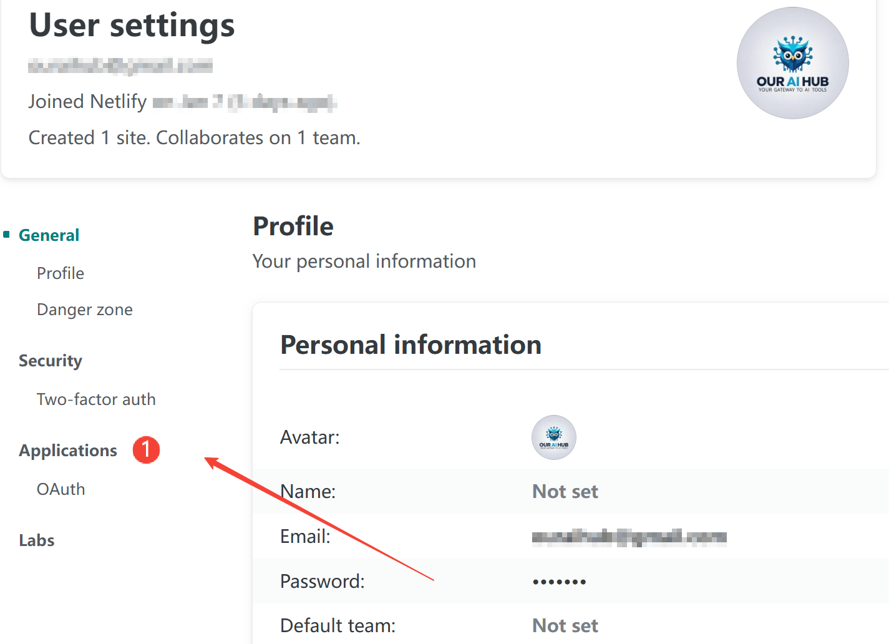
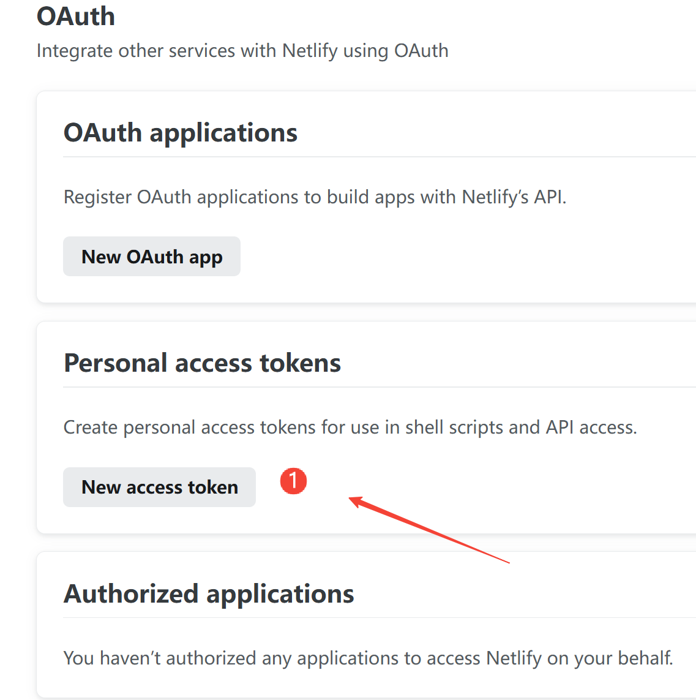
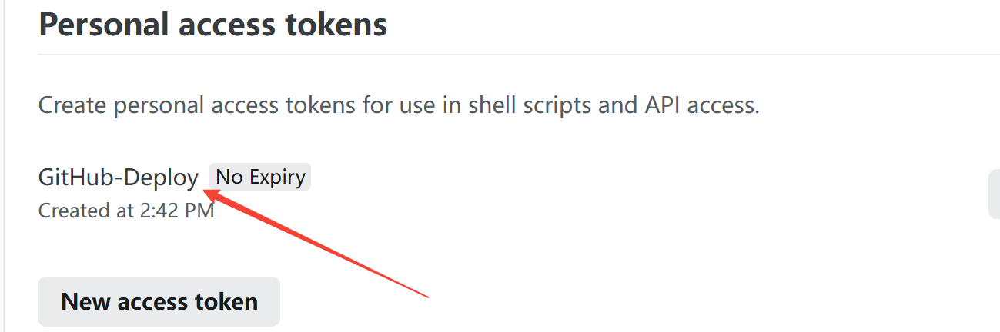

# Netlify 部署指南

## 自动部署（推荐）

> **重要提示**：首次配置自动部署时，需要先完成一键部署以获取必需的 NETLIFY_SITE_ID。

### 第一步：完成一键部署

[](https://app.netlify.com/start/deploy?repository=https://github.com/blog-starter/notionNext-starter)

1. 点击上方按钮，跳转至 Netlify
2. 绑定 GitHub 账号并填写 `NOTION_PAGE_ID` 环境变量
3. 等待部署完成，记录生成的 NETLIFY_SITE_ID（后续自动部署需要用到）

### 第二步：配置自动部署

1. Fork 此项目到你的 GitHub 账号下

2. 配置 GitHub Actions 工作流:
   - 检查项目根目录是否存在 `.github/workflows` 文件夹，如果不存在则创建
   - 从 `workflows/netlify.yml` 复制到 `.github/workflows/netlify.yml`
   > 注意：如果 `.github/workflows` 目录已存在，直接复制配置文件即可
   ```bash
   # 在项目根目录创建工作流目录（如果不存在）
   mkdir -p .github/workflows
   
   # 复制 Netlify 部署工作流配置
   cp workflows/netlify.yml .github/workflows/
   ```

3. 获取 Notion 页面 ID:
   - 打开你的 Notion 页面
   - 点击右上角的 "Share" 按钮并设置为 "Public"
   - 从浏览器地址栏复制页面 ID:
     ```
     https://www.notion.so/xxx/Your-Page-Title-{page_id}
     ```
   - 页面 ID 是 32 位的字符串，例如:
     ```
     02ab3b8678004aa69e9e415905ef32a5
     ```
   - 如果需要多语言支持，可以用逗号分隔多个页面 ID:
     ```
     02ab3b8678004aa69e9e415905ef32a5,en:7c1d570661754c8fbc568e00a01fd70e
     ```

4. 在 Netlify 上完成初始部署:
    1. 登录 [Netlify](https://app.netlify.com)
    2. 点击 "New site from Git"
    3. 选择你 fork 的 GitHub 仓库
    4. 设置构建配置:
       - Build command: `yarn build`
       - Publish directory: `out`
    5. 点击 "Deploy site" 开始部署

5. 获取 Netlify 配置:

   #### 获取 NETLIFY_SITE_ID:
   1. 在完成初始部署后，点击你的站点
   

   2. 点击左侧菜单的 "Site settings"
   

   3. 在 "Site information" 中找到并复制 "Site ID"
   

   > 注意：Site ID 是一个类似 `1234abcd-5678-efgh-ijkl-mnopqrstuvwx` 的字符串

   #### 获取 NETLIFY_AUTH_TOKEN:
   1. 登录 [Netlify](https://app.netlify.com)
   2. 点击右上角头像，选择 User Settings
   

   3. 进入 Applications 页面
   

   4. 点击 New access token
   

   5. 输入令牌名称（例如: GitHub-Deploy）
   

   6. 复制生成的令牌（注意保存，仅显示一次）

6. 在 GitHub 仓库的 Settings -> Secrets and variables -> Actions 中添加以下环境变量:

   ```bash
   NOTION_PAGE_ID         # 你的 Notion 页面 ID (必需)
   NETLIFY_AUTH_TOKEN     # Netlify 个人访问令牌 (必需)
   NETLIFY_SITE_ID        # 从第一步一键部署后获取的站点 ID (必需)
   ```

7. 推送代码到 main 分支，此时将:
   - 触发自动部署
   - 启用每天早8点和晚8点的自动部署（UTC 0:00 和 12:00）
   - 为后续的 Pull Request 启用预览部署

### 部署特性

- ✅ 自动部署 main 分支更新
- ✅ 自动为 Pull Request 创建预览部署
- ✅ 自动在 PR 和提交中添加部署状态评论
- ✅ 每天早8点和晚8点自动更新部署（UTC 0:00 和 12:00）

### 手动部署

你也可以手动部署到 Netlify:

1. 安装依赖:
```bash
yarn install
```

2. 创建 `.env.local` 文件并添加环境变量:
```bash
NOTION_PAGE_ID=xxx    # 你的 Notion 页面 ID (必需)
```

3. 构建静态文件:
```bash
yarn build
```

4. 使用 Netlify CLI 部署:
```bash
netlify deploy
```

### 常见问题

1. 部署失败
   - 检查环境变量是否正确配置
   - 确认 Netlify 项目设置正确
   - 查看构建日志定位具体错误

2. 图片加载失败
   - 确认 Notion 页面和图片已设为公开访问
   - 确认 `next.config.js` 中已配置相应的图片域名

3. 预览部署未生成
   - 确认 GitHub Actions 权限设置正确
   - 检查 Netlify token 是否有效

### 其他可选配置

你可以在 Netlify 项目设置中添加以下环境变量:

```bash
NEXT_PUBLIC_THEME      # 主题，默认 'simple'
NEXT_PUBLIC_LANG       # 语言，默认 'zh-CN'
NEXT_PUBLIC_AUTHOR     # 作者名称
NEXT_PUBLIC_LINK       # 网站地址
```

> 提示：如果不在 Netlify 中配置这些值，将使用 blog.config.js 中的默认值。建议至少配置必需的环境变量。
